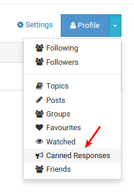
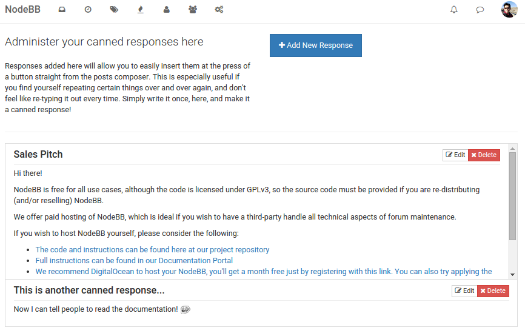
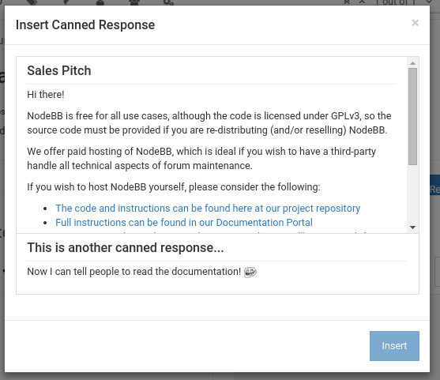

# Canned Responses for NodeBB

This plugin exposes a new user settings page that allows you to define snippets of text that can be quickly appended to a post.

Comes in handy for getting across messages that you often find yourself typing over and over again.

## Installation

Install this plugin via plugins page in your ACP. Alternatively, `npm install nodebb-plugin-canned-responses`

## Screenshots

